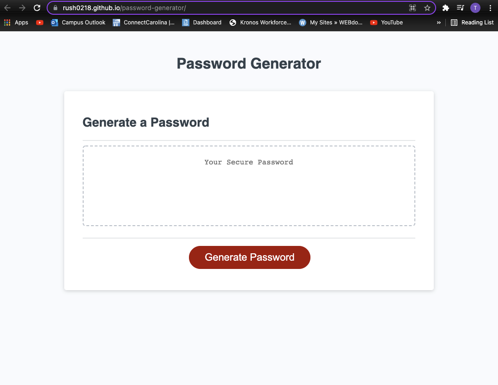

# password-generator

## Purpose 
The purpose of 'Password Generator' is to create a unique secure password based on the criteria chosen by the user.
You can choose to create a password from 8 to 128 characters long.
You can choose to include special characters, numbers, and letters(lowercase/uppercase).

## Built with 
* HTML
* CSS
* JS

# Website
https://rush0218.github.io/password-generator/

## Screenshot
